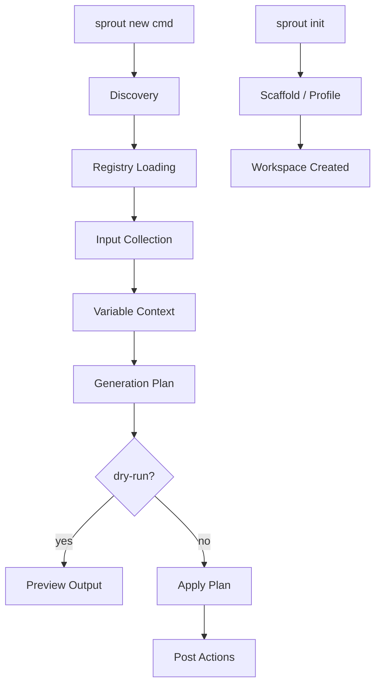

# sprout-architecture

## Overview

sprout 是一个模板驱动的项目内文件/目录生成器。用户通过 `sprout new <command>` 从预定义的 command package 生成文件。

本文档描述 **运行时核心架构**，覆盖从 `.sprout/` 发现到文件生成完成的完整数据流。不覆盖 CLI 参数解析细节和内置文档系统。

**阅读对象**：需要修改 sprout 核心逻辑的开发者 / Agent。

---

## Architecture



### 核心数据流

```
CLI args
  → discover_project_root()        # 找到 .sprout/
  → load_registry()                # 加载所有 command packages
  → collect_inputs()               # 收集 + 校验用户输入
  → build_variable_context()       # 合并输入 + 内置变量
  → build_generation_plan()        # 规划每个 asset 的目标路径和动作
  → apply_generation_plan()        # 实际创建文件/目录
  → plan_post_actions()            # 渲染 action 命令
  → execute_actions()              # 执行 post-generation 命令
```

---

## Components

### 1. Discovery (`core.py`)

**算法**：从 `start` 目录开始，`.resolve()` 后逐级向上查找包含 `.sprout/` 子目录的祖先。到达文件系统根仍未找到则抛出 `DiscoveryError`。

```python
discover_project_root(start: Path, directory_name: str = '.sprout') -> Path
```

**关键行为**：
- 使用 `Path.resolve()` 处理符号链接
- 返回的是 **项目根目录**（`.sprout/` 的父目录），不是 `.sprout/` 本身
- `directory_name` 参数可配置，但默认且唯一使用值为 `'.sprout'`

### 2. Dual-Directory Discovery (`core.py`)

Command packages 从两个目录加载，按优先级排序：

| 优先级 | 目录 | 常量名 | 说明 |
|--------|------|--------|------|
| 1 | `.sprout/__new__/` | `PREFERRED_COMMANDS_DIRNAME` | 首选写入目录 |
| 2 | `.sprout/commands/` | `LEGACY_COMMANDS_DIRNAME` | 向后兼容，运行时只读 |

**`iter_command_package_dirs()`** 按 `(preferred, legacy)` 顺序遍历，每个目录内按 `sorted()` 字典序迭代子目录。

**迁移逻辑** (`scaffold.py: ensure_preferred_commands_dir()`):
- 仅 `commands/` 存在 → 整体 `rename` 为 `__new__/`
- 两者都存在 → 将 `commands/` 中不冲突的子目录 `rename` 到 `__new__/`，尝试 `rmdir` 清理空目录
- 迁移仅在 **写入路径**（`init` / `builtin`）触发，纯读取（`list` / `new` / `doctor`）不迁移

### 2b. Global Mode Discovery (`core.py`)

全局模式通过 `-g`/`--global` CLI 标志激活，使用独立的注册表和发现机制。

```python
GLOBAL_SPROUT_DIR = Path.home() / '.config' / 'sprout'

def discover_global_dir() -> Path:
    # 直接检查固定路径，不做向上搜索

def iter_global_command_package_dirs(global_dir: Path) -> list[Path]:
    # 只扫描 __new__/，不兼容 commands/ 旧目录
```

**关键差异**：
- 全局发现不做向上搜索，直接读固定路径
- 全局目录只扫描 `__new__/`，无 `commands/` 兼容
- `sprout init --global` 创建全局目录结构

**两套注册表完全隔离**：项目级和全局级不共存、不合并、无优先级逻辑。CLI 标志决定走哪条路径。

### 3. Registry (`core.py` + `models.py`)

```python
@dataclass(slots=True)
class CommandRegistry:
    root: Path              # 项目根目录
    sprout_dir: Path        # .sprout/ 绝对路径
    config: ProjectConfig   # 项目配置
    commands: dict[str, CommandSpec]      # 可用命令 (name → spec)
    invalid: list[CommandIssue]           # 解析失败的 packages
    conflicts: list[CommandIssue]         # 同名冲突的 packages
```

**加载规则**：
1. 遍历所有 command package 目录
2. 每个目录必须包含 `manifest.yaml` / `manifest.yml` / `manifest.json`（按此顺序查找第一个）
3. 解析失败 → 记录到 `invalid`，不中断其他命令加载
4. 同名命令 → **全部排除**到 `conflicts`，不选任何一个

### 4. Manifest / Config 文件格式 (`core.py`)

**支持的配置文件**（项目级，`.sprout/` 下）：
```
config.yaml > config.yml > config.json
```

**支持的 manifest 文件**（command package 内）：
```
manifest.yaml > manifest.yml > manifest.json
```

YAML 解析依赖 PyYAML（`yaml.safe_load`）。缺少 PyYAML 时给出明确安装提示。JSON 使用标准库 `json`。

### 5. CommandSpec 结构 (`models.py`)

```python
@dataclass(slots=True)
class CommandSpec:
    name: str                        # 命令名（默认取目录名）
    description: str                 # 命令描述
    package_dir: Path                # command package 目录
    manifest_path: Path              # manifest 文件路径
    inputs: list[InputSpec]          # 输入字段定义
    assets: list[AssetSpec]          # 输出资产定义
    actions: list[ActionSpec]        # 生成后动作
    conflict: ConflictPolicy | None  # 命令级冲突策略（可选）
    root: str | None                 # 全局模式生成基座（模板字符串）
```

**InputSpec 类型系统**：

| type | 校验 | 额外字段 |
|------|------|----------|
| `string` | 非空（required 时） | — |
| `number` | `float()` 转换 + `min`/`max` 边界 | `minimum`, `maximum` |
| `enum` | 值必须在 `enum` 列表中 | `enum: list[str]`（必填） |

**AssetSpec**：

| 字段 | 说明 |
|------|------|
| `type` | `file` 或 `dir` |
| `path` | 相对路径模板（支持 `{{...}}` 占位符） |
| `template` | 模板文件路径（相对于 package_dir），用于 file 类型 |
| `content` | 内联内容字符串（与 template 二选一） |
| `ref` | 可选标识符，用于后续 asset/action 引用 |

**ActionSpec**：

| 字段 | 说明 |
|------|------|
| `phase` | 当前仅支持 `post` |
| `run` | argv 列表形式，如 `["git", "init"]` |
| `shell` | shell 字符串形式（与 run 互斥） |
| `cwd` | 工作目录模板（相对路径基于 project root） |

---

## Template Variable System (`core.py`)

占位符语法：`{{expression}}`，空格容错（`{{ expr }}` 等价）。

### 变量类别

| 类别 | 变量 | 来源 |
|------|------|------|
| **用户输入** | `{{name}}`, `{{type}}` 等 | manifest `inputs` 定义 |
| **日期时间** | `YYYY` `YY` `MM` `DD` `hh` `mm` `ss` `date` `time` `datetime` `timestamp` | `build_variable_context()` 快照 |
| **项目变量** | `project.root` (posix 绝对路径), `project.root_name` (目录名) | `_build_project_context()` | **项目模式** |
| **全局变量** | `home` (posix 绝对路径), `cwd` (posix 绝对路径), `platform` (`win32`/`darwin`/`linux`) | `_build_global_context()` | **全局模式** |
| **Asset 引用** | `assets.<ref>.<suffix>` | 前序 asset 的 `ref` 字段 |
| **随机令牌** | `rand.str[:N]`, `rand.num[:N]` | 每次求值生成新值 |

### Asset 引用后缀

| 后缀 | 含义 | 示例值 |
|------|------|--------|
| `abs_path` | 绝对路径 (posix) | `/home/user/project/issues` |
| `rel_path` | 相对于 project root (posix) | `issues` |
| `name` | 文件/目录名 | `issues` |
| `parent_abs` | 父目录绝对路径 | `/home/user/project` |
| `parent_rel` | 父目录相对路径 | `` (空字符串表示 root) |

### 作用域规则

| 作用域 | 可用变量 | 使用位置 |
|--------|----------|----------|
| `base` | 用户输入 + 内置时间 | — (目前未直接使用) |
| `asset` | base + `project.*` **或** `home`/`cwd`/`platform` + `assets.<ref>.<suffix>` (仅前序, 不含 bare ref) | `assets[*].path`, `assets[*].template` 内容 |
| `action` | base + `project.*` **或** `home`/`cwd`/`platform` + `assets.<ref>` (含 bare ref = abs_path) | `actions[*].run`, `actions[*].shell`, `actions[*].cwd` |

**关键约束**：
- Asset 路径模板只能引用 **声明顺序在前面** 的 asset ref（禁止前向引用）
- Asset 作用域禁止 bare `{{assets.ref}}`，必须带后缀
- Action 作用域允许 bare `{{assets.ref}}`，等价于 `abs_path`
- `rand.*` 每次渲染独立生成，默认长度 8，最大 128
- `rand.str` 使用 `digits + ascii_letters`，`rand.num` 仅 `digits`

### 渲染引擎

```python
render_text(template: str, context: dict[str, Any], *, scope: str) -> str
```

- 纯正则替换（`PLACEHOLDER_PATTERN`），无递归、无逻辑分支
- 未知变量 → 立即抛出 `ValidationError`（带上下文错误提示）
- `rand.*` 不走 context 查找，在 `_resolve_expression` 中即时生成

---

## Generation Pipeline (`core.py`)

### Phase 1: Plan (`build_generation_plan`)

对每个 asset **按声明顺序**：
1. 构建当前 asset 可见的 context（base + project + 已完成的 asset refs）
2. 渲染 `asset.path` → `requested_path`
3. 校验：非空、非绝对路径、不逃逸 project root
4. 渲染 `template` / `content` → `content` 字符串（file 类型）
5. 调用 `_resolve_asset_action` 决定 `(action, final_path)`
6. 记录 ref → `ref_paths` 供后续 asset 使用

**排序**：最终 plan 按 `(type_priority, declaration_index)` 排序——`dir` 排在 `file` 前面，确保目录先创建。

### Phase 2: Apply (`apply_generation_plan`)

按 plan 顺序执行：
- `dir` → `mkdir(parents=True, exist_ok=True)`
- `file` → `parent.mkdir(...)` + `write_text(encoding='utf-8')`
- `skip` → 记录但不操作
- `dry_run=True` → 只返回结果，不实际写入

### Phase 3: Post Actions (`plan_post_actions` + `execute_actions`)

1. 构建 action context：用户输入 + project vars + **所有** asset refs（含 bare ref）
2. 渲染 `run` / `shell` / `cwd` 模板
3. `cwd` 相对路径 → 基于 project root 解析，校验不逃逸
4. 执行：`subprocess.run(argv)` 或 `subprocess.run(shell, shell=True)`
5. 非零退出码 → 抛出 `GenerationError`

---

## Conflict Resolution (`core.py`)

### 优先级链

```
CLI --conflict > manifest conflict > config.yaml conflict > 'fail' (硬编码默认)
```

```python
effective_conflict_policy(command, project_config, override) -> ConflictPolicy
```

### 策略行为

| 策略 | 目标不存在 | 目标存在 (file) | 目标存在 (dir) |
|------|-----------|----------------|---------------|
| `fail` | create | **raise GenerationError** | reuse |
| `overwrite` | create | overwrite | reuse |
| `skip` | create | skip | reuse |
| `rename` | create | create with `_02` suffix | reuse |

**特殊情况**：
- file/dir 类型不匹配 → 无条件 `GenerationError`
- 同一次运行中路径重复 → `GenerationError`（`occupied` set 检测）
- `rename` 后缀从 `_02` 开始递增，同时检查文件系统和当前 plan 的 `occupied` set

---

## Scaffold System (`scaffold.py`)

### `sprout init`

1. 创建 `.sprout/` 目录
2. `ensure_preferred_commands_dir()` → 创建 `__new__/`（含迁移逻辑）
3. 写入 `config.yaml`（从内置模板）
4. 加载 profile（`minimal` / `docs` / 自定义 JSON）→ 创建额外目录和文件
5. `--with-examples` → 复制 `issue` + `task` 示例 command packages

### `sprout builtin <name>`

1. 检查 `.sprout/` 存在
2. `ensure_preferred_commands_dir()` → 确保 `__new__/` 就绪
3. 在 `__new__/<name>/manifest.yaml` 写入带注释的模板
4. 已存在则跳过，不覆盖

### Profile 结构

```json
{
  "directories": ["path/to/dir"],
  "files": [
    {"path": "path/to/file", "content": "..."}
  ]
}
```

所有路径相对于 `.sprout/`，写入前校验不逃逸 `.sprout/` 边界。

---

## Error Hierarchy (`models.py`)

```
SproutError (base)
├── DiscoveryError      # .sprout/ 未找到
├── ValidationError     # 配置/输入校验失败
├── GenerationError     # 生成过程中的冲突/错误
└── UserAbortError      # 用户取消交互
```

CLI 层统一捕获这四种异常，打印消息后返回 exit code 1。

---

## Key Decisions

| 决策 | 选择 | 理由 |
|------|------|------|
| 模板语法 | `{{var}}` 纯替换 | 刻意不引入 Jinja2 等模板引擎；保持简单、可预测、Agent 友好 |
| 目录名 `__new__/` | 对应 `sprout new` 语义 | 避免与 package 内部模板文件名混淆（`__template__/` 被否决） |
| 双目录兼容 | 运行时读两个，写入只用 preferred | 平滑迁移，不强制用户手动重命名 |
| 冲突全排除 | 同名 command 全部排除 | 避免隐式优先级引入不可预测行为 |
| YAML 可选依赖 | 缺少时给安装提示 | 保持核心零额外依赖 |
| Asset 排序 | dir 先于 file | 确保父目录在文件写入前存在 |
| 随机令牌 | `secrets` 模块 | 安全随机，适用于需要唯一性的场景 |
| 全局/项目隔离 | 两套注册表完全隔离，`-g` 切换 | 零合并逻辑、零优先级冲突、项目级代码零侵入 |
| 全局路径 | 允许绝对路径，`root` 字段声明基座 | 用户需求核心：自由在系统任意位置创建文件 |
| 全局目录 | `~/.config/sprout/` | XDG 惯例，结构镜像项目级但不带 `commands/` 旧目录 |
| 全局变量 | `home`/`cwd`/`platform` | 项目模式用 `project.*`，全局模式用独立变量集 |
| 全局沙箱 | 绝对路径跳过沙箱，相对路径用 `root` 或 cwd | 保留底线安全，不阻止用户意图 |

---

## References

- [README.md](/README.md) — 项目概览与快速开始
- [sprout/docs/user-guide.md](/sprout/docs/user-guide.md) — CLI 使用手册
- [sprout/docs/command-authoring-guide.md](/sprout/docs/command-authoring-guide.md) — 命令包编写手册
- [Change: builtin-command-bootstrap](../changes/26-04-12T17-27_builtin-command-bootstrap/spec.md) — `__new__/` 目录与 `builtin` 命令的设计决策
